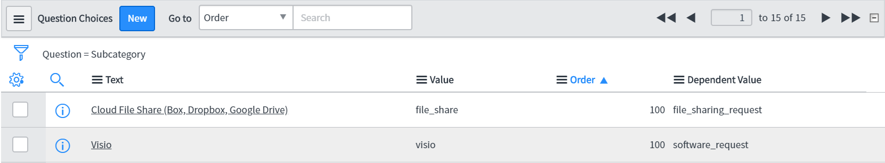

Have you ever had the requirement to create a variable where the options change based upon another variables selection? Well, you've come to the right place. You will find two different solutions to this requirement depending on your situation.
<br>
<br>

<h4>If your variables already have a relationship</h4>

To start off, figure out if your two variables already have some sort of relationship. For example: you have two reference
variables and they are pointed at two different tables `u_computer` and `u_brand`. In the `u_computer` table, let's say there's a field that is referencing the brand table already; You want to show only Dell computers if the person selects **Dell** in your brand variable. If this is your case, your solution is as simple as adding a reference qualifier.

In your `u_computer` table, you should have a field that is already referencing the `u_brand` table. Get the value, or more specifically, the column name value of this field. For this example, let's call it **u_parent**. Add your reference qualifier to your computer variable like so:

```js
javascript:"u_parent="+current.variables.brand_variable_name //add the brand variable name
```

This will restrict the options in the computer reference variable to computers that have the selected brand. But what if you want the same effect, but they don't have a relationship?
<br>
<br>

<h4>If your variables aren't related at all</h4>

In this situation, it can get complicated. If you are not using reference variables and just select-boxes, figure out which variable will be the "category" and which will be the "sub-category".

<ol>
<li>

Create a new field on the `question_choice` table with the name **u_dependent_value**.
</li>
<ul>

Since these variables use this table out-of-box, we can leverage the choice table by adding a new field.
</ul>
<li>

Create a new script-include. In this case, I've called it **SCVariableLookup**.
</li>
<ol>

We will create a reusable piece of server code that will handle the function of populating the sub-category choices. If you aren't familiar with script-includes, read more [here](https://docs.servicenow.com/bundle/orlando-application-development/page/script/server-scripting/concept/c_ScriptIncludes.html).

Take a look at the script below, make sure it is **client callable**.

```js
var SCVariableLookup = Class.create();
SCVariableLookup.prototype = Object.extendsObject(AbstractAjaxProcessor, {
    getSubCat: function() {

        //grab the category value
        var newValue = this.getParameter('sysparm_category');

        //query the choice table
        var gp = new GlideRecord("question_choice");

        //filter choices by category
        gp.addQuery("u_dependent_value", newValue);
        gp.orderBy('order');
        gp.query();

        var subcategories = [];

        //populate sub-categories into an object
        while (gp.next()) {
            subcategories.push({
                value: gp.value.toString(),
                text: gp.text.toString()
            });
        }

        //return the JSON
        return new JSON().encode(subcategories);
    },

    type: 'SCVariableLookup'
});
```

</ol>
<li>

Create an **onChange** catalog client script. This will apply to the **category** field you made. Set UI type to All.
</li>
<ol>

This client script will call the script-include above, and adjust the form accordingly.

```js
function onChange(control, oldValue, newValue, isLoading) {

    //Add the NULL option to the sub-category field.
    //We do this because we are completely changing ALL the choices in the field.
    if (isLoading) {
        g_form.addOption('subcategory', 'NULL', '-- None --');

        return;
    }
    if (newValue == oldValue) {

        return;
    }

    //Clear the options in the field to reset the field onLoad
    g_form.clearOptions('subcategory');

    //initially add a NULL option to the sub-category field
    g_form.addOption('subcategory', 'NULL', '-- None --');

    //Here's where we call the script you just created
    var ga = new GlideAjax('SCVariableLookup');

    //Add the getSubCat function to this paremeter.
    //We created this function in the script-include.
    ga.addParam('sysparm_name', 'getSubCat');

    //Add the NewValue (category) to the category paremeter
    ga.addParam('sysparm_category', newValue);

    //This is where we will populate the actual field with the options that are related to the category
    ga.getXML(function(response) {

        //this getAnswer() method will retrieve the results from the server-side code.
        var answer = ga.getAnswer();

        //Parse the results
        var obj = JSON.parse(answer);

        //Loop through the object and grab the values.
        //Add the options to the dropdown field.
        for (var i = 0; i < obj.length; i++) {
            g_form.addOption('subcategory', obj[i].value, obj[i].text);

        }
    });
}
```
</ol>
<li>

Add the dependent values to your choices.
</li>
<ol>

Go in to your sub-category variable, and configure each choice by adding the dependent value to each choice. The easiest way to do this is to scroll down to the choices and configure the columns to show the dependent value column.



Change the **Dependent Value** column to the value of the category choice for each sub-category choice.
</ol>
</ol>
  

